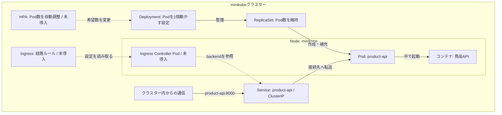

# minikubeの商品API構成図

- **管理の流れ**：DeploymentがReplicaSetを管理し、ReplicaSetが希望数のPodを保つ。Podを削除すると、新しいPodが補充される。
- **通信の流れ**：Serviceが現在のPodへ通信を届ける。ServiceはPodを作らない。今回は商品APIのPod自身からService名を使って通信した。
- **配置**：PodとコンテナはNode上で動く。Deployment・ReplicaSet・Serviceはクラスター内の論理的なリソースであり、Nodeの中に置いた箱ではない。
- **破線は今後の構想**：Ingressを使うにはIngress Controllerが必要。HPAがCPUなどの使用量で増減するにはメトリクスを取得できる構成も必要。どちらもまだ作成していない。Controller自体が通信を中継するとは限らないため、外部からの通信経路は採用する方式を理解・選定してから描く。

Podを2個に増やすとServiceの接続先も2つになる。PodのIPが変わっても、Serviceの名前は変わらない。図は現在の `replicas: 1` を示している。

[実行した手順に戻る](./minikubeで商品APIを動かす手順.md)
