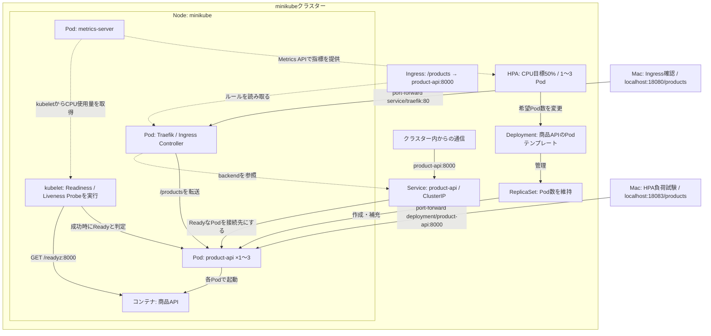

# minikubeの商品API構成図

- **管理の流れ**：HPAがCPU使用率に応じてDeploymentの希望Pod数を1〜3個の範囲で変更する。DeploymentがReplicaSetを管理し、ReplicaSetが希望数のPodを保つ。
- **CPU指標の流れ**：metrics-serverがkubeletからPodのCPU使用量を収集し、HPAがMetrics API経由で参照する。目標50%は、商品APIコンテナのCPU request `100m` に対する割合。
- **通信の流れ**：Macから一時的にTraefikへport-forwardし、TraefikがIngressの `/products` ルールに従って商品APIのPodへ転送した。`curl` でHTTP 200と商品データを確認した。TraefikはbackendのServiceを参照するが、標準設定ではPod IPへ直接転送する（[Traefik公式](https://doc.traefik.io/traefik/reference/routing-configuration/kubernetes/ingress/)）。
- **Probe**：Node上のkubeletがコンテナの `/readyz` を確認する。Readinessが成功するとPodはServiceの接続先になり、Livenessが失敗し続けるとコンテナが再起動される。Service自身がチェックするわけではない。
- **配置**：商品API、Traefik、metrics-serverのPodとkubeletはminikubeのNode上で動く。kubeletはPodの中ではない。IngressやService、HPAはNodeの中に置いた箱ではなく、Kubernetesの論理的なリソース。
- **IngressとController**：Ingressは経路のルールで、Traefikはそのルールを読み取り、ローカルでは通信も中継する。AWSのALBはこの図にはない。

HPAの負荷試験ではMacから商品APIのDeploymentへ直接port-forwardし、HPAが1 Podから3 Podに増やすことを確認した。Serviceの接続先にも3つのPod IPが登録されたが、この負荷試験でTraefik経由の分散は検証していない。Pod数やIPが変わってもServiceの名前は変わらない。この試験は1 Nodeのminikube上で行ったため、複数Node・AZへの分散も検証していない。

[実行した手順に戻る](./minikubeで商品APIを動かす手順.md)
