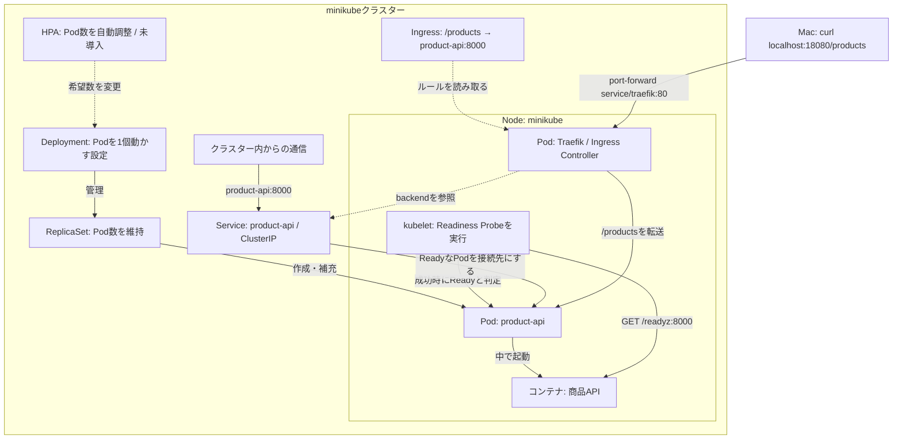

# minikubeの商品API構成図

- **管理の流れ**：DeploymentがReplicaSetを管理し、ReplicaSetが希望数のPodを保つ。Podを削除すると、新しいPodが補充される。
- **通信の流れ**：Macから一時的にTraefikへport-forwardし、TraefikがIngressの `/products` ルールに従って商品APIのPodへ転送した。`curl` でHTTP 200と商品データを確認した。TraefikはbackendのServiceを参照するが、標準設定ではPod IPへ直接転送する（[Traefik公式](https://doc.traefik.io/traefik/reference/routing-configuration/kubernetes/ingress/)）。
- **Readiness Probe（準備状態の確認）**：Node上のkubeletがコンテナの `/readyz` を確認する。成功してPodがReadyになると、Serviceの接続先として使われる。Service自身がチェックするわけではない。
- **配置**：商品APIのPodとTraefikのPod、kubeletはminikubeのNode上で動く。kubeletはPodの中ではない。IngressやServiceはNodeの中に置いた箱ではなく、Kubernetesの論理的なリソース。
- **IngressとController**：Ingressは経路のルールで、Traefikはそのルールを読み取り、ローカルでは通信も中継する。AWSのALBはこの図にはない。
- **今後の構想**：HPAは未導入。CPUなどの使用量でPod数を自動調整するには、メトリクスを取得できる構成も必要。

Podを2個に増やすとServiceの接続先も2つになる。PodのIPが変わっても、Serviceの名前は変わらない。図は現在の `replicas: 1` を示している。

[実行した手順に戻る](./minikubeで商品APIを動かす手順.md)
